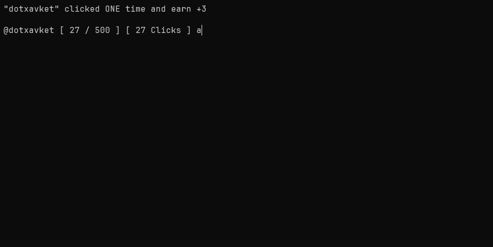

# Clicker Command

A simple executable click game to terminal, where you click using a command to earn clicks. 


## Sumary

- [Clicker Command](#clicker-command)
  - [Sumary](#sumary)
  - [Main](#main)
  - [Functionality's](#functionalitys)
  - [How to Play](#how-to-play)
    - [Commands](#commands)
  - [Installing](#installing)

## Main

The *Clicker Command* is a minimalist game, perfect for those looking for fast and fun distraction directly in terminal. You aim is simple: click using custom commands to accumulate clicks and sell them for coins, use coins to upgrade your clicks.
- Just install and execute.


## Functionality's


## How to Play



1. **Execute the game**: Open the executable (view the [Installing](#installing) section here) 
2. **Start to Click**: Use the commands `settings` to view the *commandToClick* and use the command to click.
3. **View your clicks**: Use the command `stats+` to view your stats.
4. **Sell your clicks**: Use the command `sell` to sell your clicks for coins.
5. **Do Rebirth**: Use the command `rebirth` to earn **x2** Clicks Multiplier


### Commands

These is all commands that can be used.

``sell`` - to sell your clicks for coins <br>
``rebirth`` - to do rebirth and earn more clicks <br>
``stats`` - show your stats <br>
``stats+`` - show your stats but detailed <br>
``upgrader`` - open the upgrader area <br>
``settings`` - show all settings that you can change <br>
``set nameask`` - toggle the username visibility <br>
``set rebirthask`` - toggle the rebirth visibility <br>
``set commandtoclick`` - to change the input command used to click <br>
``codes`` - open the code reward area <br>
``reset all`` - reset all <br>
``reset stats`` - reset your stats <br>
``reset settings`` - reset your settings changes <br>
``load`` - load datas manually <br>
``save`` - save datas manually <br>
``edit username`` - open the edit area to change username <br>
``diamond shop`` - open the diamond shop <br>
``cls`` - use to clear the terminal <br>
``help`` - use to view all commands that you can use <br>


## Installing

It's a terminal executable, the install is super simple.

1. **Install Executable**:
   - Go to section [Release](https://github.com/G4brielXavier/click-command/releases/tag/simple) of our Github Repositorie
   - Download the file `click_command.exe` to your OS

2. **Execute in Terminal**:
   - Open the terminal (CMD, Powershell, Terminal, etc.) in folder where you have been installed.
   - Execute the .exe with the command:
      ```bash
      ./click_command.exe
      ```
      * If you've permission issues in the Linux/macOS, may be necessary to give executable permission 

      ```bash
      chmod +x click_command
      ```

